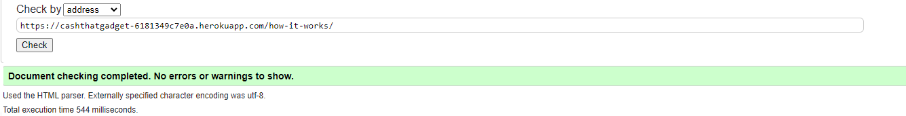

# CashThatGadget Website Testing Documentation

The CashThatGadget website has been tested using the following methods:

- [Code Validation](#code-validation)
    - [W3C HTML Validator](#w3c-html-validator) 
    - [W3C CSS Validator](#w3c-css-validator)
    - [JSHINT Javascript Code Quality Tool](#jshint-javascript-code-quality-tool)
    - [Python Validation using VSCode](python-validation-using-vscode)
- [Lighthouse](#lighthouse)
- [Responsiveness](#responsiveness)
- [Browser Compatibility](#browser-compatibility)
- [Testing User Stories](#testing-user-stories)
    - [First Time User](#first-time-user)
    - [Returning User](#returning-user)
    - [Business Owner](#business-owner)
- [Manual Testing](#manual-testing)
- [Automated Testing](#automated-testing)
- [Peer Review](#peer-review)
- [Bugs](#bugs)
    - [Resolved](#resolved)


## Code Validation

### W3C HTML Validator
The HTML code of the CashThatGadget website has been validated using the W3C HTML Validator. All pages passed without any critical errors or issues.

### Home Page
<h2 align="center">

### Sell My Gadget Page
<h2 align="center">

### How It Works Page
<h2 align="center">

### Why Use Us Page
<h2 align="center">

### Support Page
<h2 align="center">

### Contact Us Page
<h2 align="center">

### Login Page
<h2 align="center">

### Sign up Page
<h2 align="center">

### W3C CSS Validator
The CSS code has been validated using the W3C CSS Validator. The site passed all checks and there are no major CSS validation issues.

### base.css
<h2 align="center">

### mediaqueries.css
<h2 align="center">

### JSHINT Javascript Code Quality Tool
JavaScript code quality has been validated using **JSHint**. No major issues were detected, ensuring that the scripts follow best practices.

### Python Validation using VSCode
The Python code was validated using VSCode. Python linting tools like **Pylint** and **Flake8** were used to ensure code quality, and there were no major issues reported.

## Lighthouse
Lighthouse was used to evaluate the website's performance, accessibility, SEO, and best practices. The website scored highly on performance and accessibility, with suggestions for further improvements.

### Homepage
<h2 align="center">

<h2 align="center">


## Responsiveness
The website was tested across various screen sizes to ensure it is fully responsive. All elements adjust properly, providing a seamless experience on desktops, tablets, and mobile devices.

## Browser Compatibility
The website was tested across multiple browsers, including:
- Google Chrome
- Mozilla Firefox
- Microsoft Edge
- Safari

The website functions correctly in all major browsers without issues.

Responsivity tests were carried out using Google Chrome DevTools. Device screen sizes covered include:
- iPhone SE
- iPhone XR
- iPhone 12 Pro
- Pixel 5
- Samsung Galaxy S8+
- Samsung Galaxy S20 Ultra
- iPad Mini
- iPad Air
- Surface Pro 7
- Surface Duo
- Galaxy Fold
- Samsung Galaxy A51/71
- Nest Hub
- Nest Hub Max

I also personally tested the website on Cubot kingkong, Dell XPS 15 laptop and a Dell widescreen monitor.

## Testing User Stories

### First Time User
- **Test Case**: Visiting the site for the first time as a new user.
- **Expected Outcome**: The user should be able to easily navigate the site, register a sale, and post their gadget.

### Returning User
- **Test Case**: Logging into the site as a returning user.
- **Expected Outcome**: The user should be able to seamlessly log in and proceed with their sale process.

### Business Owner
- **Test Case**: Business owners should be able to manage their listings, monitor sales, and update their profile settings.
- **Expected Outcome**: All features work as expected without issues.

## Manual Testing
The site underwent manual testing to identify edge cases, user interaction patterns, and potential usability improvements. Testing focused on form submissions, navigation, and content display.

## Automated Testing
Automated tests were written for core functionalities like registration, posting a gadget, and completing a sale. These tests ensure that the website works reliably after updates.

* I had to disable email verification to allow my tests that required log in to work.

## Bugs

### Resolved

### Payments & Cart

### 1. Issue: Missing Payment Method Handling
**Description:**
The revieworder page allowed users to select a payment method, but the backend did not validate or process the selected method properly.

**Cause:**
The `payment_method` field in the form was not dynamically validated, and fields for the unselected payment method were not being disabled.

**Fix:**

Added JavaScript to dynamically enable and disable input fields based on the selected payment method:

```javascript
function selectPaymentMethod(method) {
    const paymentMethodInput = document.getElementById('payment-method');
    paymentMethodInput.value = method;

    const bankFields = document.getElementById('bank-transfer-fields');
    const paypalFields = document.getElementById('paypal-fields');

    if (method === 'bank-transfer') {
        bankFields.style.display = 'block';
        paypalFields.style.display = 'none';
    } else if (method === 'paypal') {
        bankFields.style.display = 'none';
        paypalFields.style.display = 'block';
    }
}
```

### 2. Issue: Sort Code Input Navigation
**Description:**
Entering the sort code fields manually was tedious due to the lack of automatic focus change between input fields.

**Fix:**

Added event listeners to automatically move focus to the next field when two digits are entered:

```javascript
document.querySelectorAll('.sort-code-container input').forEach((input, index, inputs) => {
    input.addEventListener('input', (e) => {
        if (e.target.value.length === 2 && index < inputs.length - 1) {
            inputs[index + 1].focus();
        }
    });
    input.addEventListener('keydown', (e) => {
        if (e.key === 'Backspace' && e.target.value === '' && index > 0) {
            inputs[index - 1].focus();
        }
    });
});
```

### 3. Issue: AJAX Error in remove_from_cart
**Description:**
The "Remove" button on the revieworder page did not dynamically update the cart when an item was removed.

**Cause:**
The AJAX function was not properly handling the CSRF token or reloading the cart dynamically.

**Fix:**

Updated the `removeFromCart` function to include the CSRF token and refresh the page upon successful removal:

```javascript
function removeFromCart(itemId) {
    const csrfToken = document.querySelector('input[name="csrfmiddlewaretoken"]').value;

    fetch(`remove-from-cart/${itemId}/`, {
        method: 'POST',
        headers: {
            'Content-Type': 'application/json',
            'X-CSRFToken': csrfToken,
        },
    })
    .then(response => {
        if (response.ok) {
            location.reload();
        } else {
            alert('Failed to remove item. Try again.');
        }
    })
    .catch(error => console.error("Error removing item:", error));
}
```

### Profile Dashboard & Admin
## Issue 1: Buttons Not Disappearing After User Response

### Observed Behavior:
- The "Accept" and "Reject" buttons remained visible even after the user selected a response (Accepted/Rejected).

### Root Cause:
- The conditional logic in the template was not correctly checking for the presence of a `user_response` value.

### Solution:
Updated the template logic to:
```django

    <p>You have already {{ order.user_response|lower }} the offer.</p>

    <form method="post" action="">
        
        <input type="hidden" name="order_id" value="{{ order.id }}">
        <button type="submit" name="response" value="Accepted" class="btn btn-success">Accept</button>
        <button type="submit" name="response" value="Rejected" class="btn btn-danger">Reject</button>
    </form>

```

---

## Issue 2: Frontend Buttons Not Updating Admin

### Observed Behavior:
- Clicking "Accept" or "Reject" on the frontend did not reflect changes in the admin panel.

### Root Cause:
- The POST request handling in the backend was incomplete, and the AJAX functionality was missing for seamless updates.

### Solution:
1. Updated the backend view to handle `POST` requests for updating the `user_response` field.
2. Added the following JavaScript to handle AJAX calls:
```javascript
function updateUserResponse(orderId, response) {
    fetch('/admin/update-user-response/', {
      method: 'POST',
      headers: {
        'Content-Type': 'application/json',
        'X-CSRFToken': document.querySelector('[name=csrfmiddlewaretoken]').value,
      },
      body: JSON.stringify({
        'order_id': orderId,
        'response': response
      })
    })
    .then(response => response.json())
    .then(data => {
      if (data.success) {
        alert("User response updated successfully!");
        location.reload();
      } else {
        alert("Failed to update user response.");
      }
    })
    .catch(error => {
      alert("Error: " + error);
    });
}
```

---

## Issue 3: Buttons Showing on Orders Without Revised Price

### Observed Behavior:
- "Accept" and "Reject" buttons appeared on orders that did not have a revised price.

### Root Cause:
- Missing check for `revised_price` in the template logic.

### Solution:
Wrapped the button rendering logic inside a check for `revised_price`:
```django

    <td class="revised-price">
        <p>Revised Price: £{{ order.revised_price }}</p>
        <p>Reason: {{ order.revised_reason }}</p>
        <!-- Additional logic for buttons -->
    </td>

    <td>N/A</td>

```


